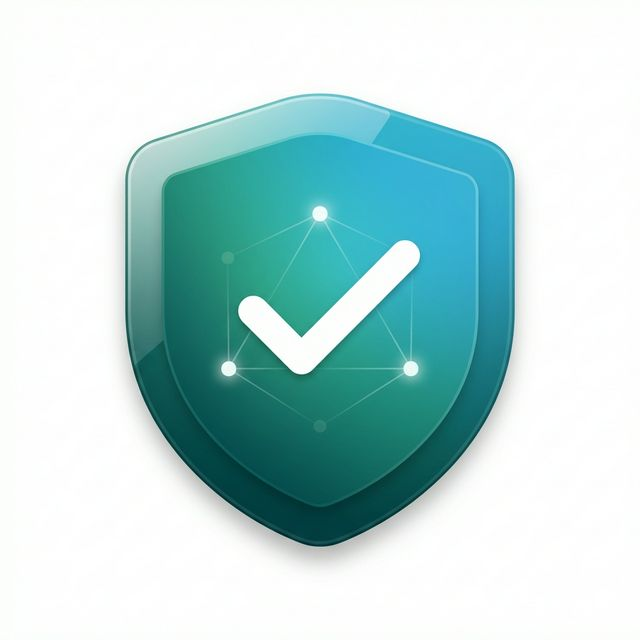
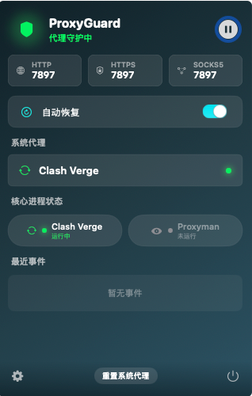
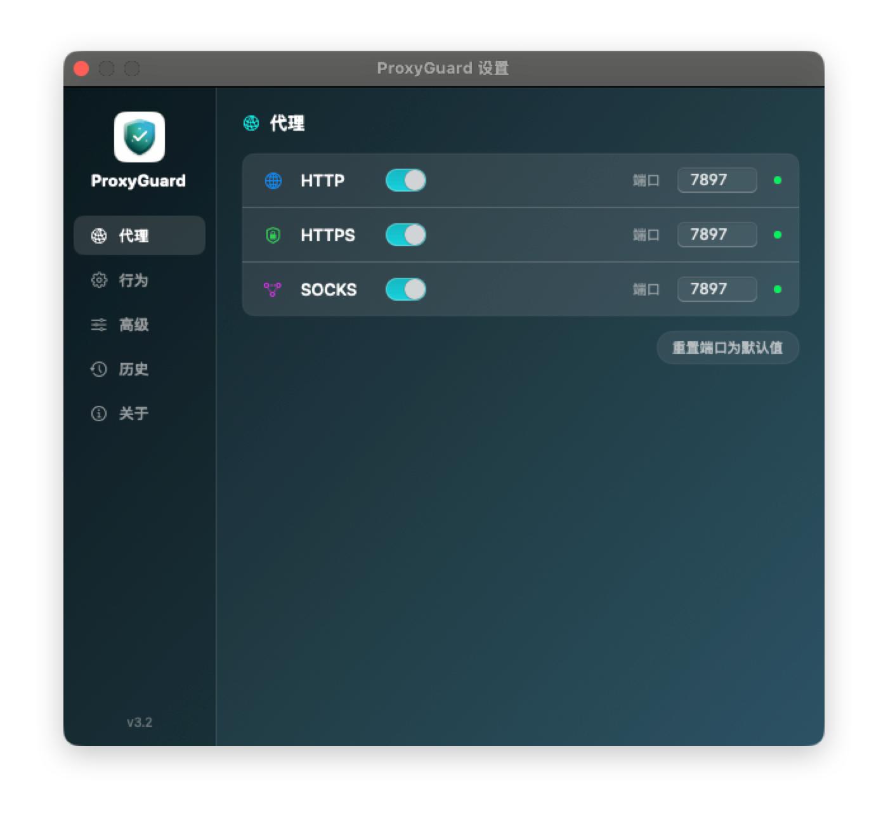

# ProxyGuard - macOS 系统代理守护工具

> **Author:** monokoo | **Created by:** Claude Code | **Version:** 3.4

<p align="center">
  
</p>
<p align="center">
  <em>青蓝渐变盾牌 · 白色对勾 · 网络节点图案</em>
</p>

## 一、做这个是干嘛的？

### 遇到的麻烦
如果你在 macOS 上同时用 **Clash Verge Rev**（科学上网）和 **Proxyman**（抓包调试），可能会遇到这个问题：

1. 平时开着 Clash Verge 做代理 `127.0.0.1:7897`。
2. 偶尔开 Proxyman 抓个包，Proxyman 会接管系统代理。
3. **把 Proxyman 关掉时**，它会顺手把系统代理清空，结果 Clash Verge 的"系统代理"也就断了。
4. 你还得手动去 Clash Verge 里重新点一下开关，就很烦。

### 怎么解决
**ProxyGuard** 就是为了解决这个麻烦。它是一个轻量的 macOS 菜单栏小工具，盯着系统代理设置。一旦发现代理被意外关掉（而 Clash 还在运行），它就自动把代理恢复回来。

---

## 二、技术实现

主要用了 Swift 5.9+ 和 SwiftUI (MenuBarExtra)，数据层采用 Swift Observation (`@Observable`) 实现精确属性追踪。直接用 Swift Package Manager 管理，不需要 Xcode 项目文件。要求 macOS 14 (Sonoma) 以上。

### 核心模块
```
ProxyGuard/
├── Package.swift               # SPM 包配置
├── build.sh                    # 构建脚本
└── Sources/ProxyGuard/
    ├── Core/                   # 核心业务逻辑
    │   ├── ProxyMonitor.swift       # 监听代理变化
    │   ├── ProxyRestorer.swift      # 负责恢复代理
    │   ├── ClashConfigReader.swift  # 读 Clash 配置文件
    │   ├── ProcessChecker.swift     # 检查进程还在不在
    │   ├── TerminalProxyManager.swift# 终端代理环境变量管理
    │   └── LogManager.swift         # 日志记录
    └── UI/                     # 界面相关
        ├── MenuBarView.swift        # 菜单栏下拉列表
        └── SettingsView.swift       # 设置窗口
```

---

## 三、功能特点 (v3.4)

### 核心
- **省电**：不用轮询，而是监听系统事件 (SCDynamicStore)，平常几乎不占 CPU。v3.4 进一步优化了闲置唤醒和定时器合并。
- **自动判断**：根据 Clash 和 Proxyman 的运行状态，决定要不要恢复代理。
- **防冲突**：加了延迟检查，防止和 Clash 自己的操作打架。
- **双重验证**：不光看进程名，还会检查 BundleID，确保没认错。
- **自带日志**：在 `~/Library/Logs/ProxyGuard/` 下有日志，出了问题好排查，也会自动清理（保留最近 7 天）。可在设置页手动关闭。
- **开机自启**：可以在设置里开。
- **失败重试**：如果恢复失败，会自动多试几次。

### 终端代理
- **自动注入**：Clash Verge 系统代理开启时，自动向 `~/.proxyguard_env` 写入 `http_proxy` / `https_proxy` / `all_proxy`，新终端打开即用。关闭后自动清除，国内网络不受影响。
- **Shell 兼容**：同时支持 zsh (`~/.zshrc`) 和 bash (`~/.bash_profile`)，一键安装 / 卸载 Shell 集成。
- **实时刷新模式**（可选）：基于 SIGUSR1 信号通知已打开的终端实时更新代理状态，零轮询开销。仅在设置中主动开启后才会向 shell 进程发信号。
- **菜单栏快捷操作**：「复制代理命令」按钮，一键把 `source ~/.proxyguard_env` 或 `unset` 命令复制到剪贴板。

### 界面
- **暗色风格**：主要是因为看起来酷一点。
- **侧边栏导航**：设置页做了个侧边栏。
- **状态显示**：能看出来现在的代理是谁接管的（Clash / Proxyman / 关了）。
- **国际化**：支持中英双语，虽然大部分时候你可能都用中文。
- **历史记录**：能看到最近几次代理变了什么，方便查问题。

### 菜单栏长这样：
```
┌─────────────────────────────────┐
│   🛡️ ProxyGuard                │
│   ✅ 代理守护中              ⏸ │
95: ├─────────────────────────────────┤
│  HTTP:7897  HTTPS:7897  SOCKS5 │
├─────────────────────────────────┤
│  🔄 自动恢复                🔘  │
├─────────────────────────────────┤
│  系统代理                      │
│  🔄 Clash Verge              │
├─────────────────────────────────┤
│  核心进程状态                   │
│  Clash Verge  │  Proxyman       │
│  🟢 运行中    │  ⚪ 未运行      │
├─────────────────────────────────┤
│  📋 最近事件                    │
│  ✅ 代理已恢复         14:25   │
│  🔄 重试中 (2/3)       14:24   │
├─────────────────────────────────┤
│  ⚙ 设置          退出 ProxyGuard│
└─────────────────────────────────┘
```

**实际截图：**

<p align="center">
  
  &nbsp;&nbsp;&nbsp;
  
</p>

---

## 四、它是怎么判断的？

简单来说，它的逻辑主要是：

1.  **先看 Proxyman**：如果 Proxyman 开着，就算它把 Clash 的代理覆盖了，也不管（因为你在抓包）。
2.  **再看 Clash**：如果 Proxyman 没开，但 Clash 开着，这时候要是代理没了，我就给它恢复回来。
3.  **防止误判**：恢复前会再确认一遍，免得你刚手动关了代理我又给你打开。

具体决策表：

| 场景 | Proxyman | 系统代理状态 | Clash 开关 | Clash 进程 | 动作 |
|------|:---:|:---:|:---:|:---:|------|
| **1a** | 开着 | Clash 端口 | 开 | 开着 | ✅ 不管 |
| **1b** | 开着 | Clash 端口 | 开 | 没开 | 🔴 关掉代理 |
| **1c** | 开着 | 没了 | 开 | 开着 | 🔵 恢复 Clash |
| **2** | 开着 | Clash 端口 | 关 | - | 🟡 恢复 Proxyman |
| **3** | 没开 | Clash 端口 | 开 | 开着 → 不管 / 没开 → 关掉 |
| **4** | 没开 | 没了 | 开 | 开着 → 恢复 Clash / 没开 → 不管 |
| **5** | 没开 | 没了 | 关 | - | ✅ 不管 |
| **6** | 没开 | Proxyman 端口 | 开 | 开着 → 恢复 Clash / 没开 → 关掉 |

---

## 五、配置说明

### 基础的
| 配置项 | 默认值 | 说明 |
|---------|---------|------|
| HTTP 代理端口 | 7897 | Clash Verge 默认端口 |
| 自动恢复开关 | 开启 | 代理没了且应该有时自动恢复 |
| 恢复延迟（秒） | 2.0 | 给 Clash 一点反应时间 |
| 界面语言 | Auto | 跟随系统 |

### 高级的 (v3.1+)
| 配置项 | 默认值 | 说明 |
|---------|---------|------|
| 开机自启 | 关闭 | 登录时自动启动 |
| 失败重试 | 开启 | 恢复失败多试几次 (最多 3 次) |
| Clash 配置文件 | `~/.../verge.yaml` | 读取 `enable_system_proxy` 字段用的 |

---

## 六、怎么装？

### 推荐方式
```bash
./build.sh && cp -r ProxyGuard.app /Applications/ && open /Applications/ProxyGuard.app
```

### 或者手动
```bash
swift build -c release
# 然后自己把 .build/release/ProxyGuard 拷出来
```

---

## 七、版本历史

| 版本 | 日期 | 主要变更 |
|------|------|----------|
| 1.0 | - | 基本功能有了 |
| 2.0 | - | 加了决策逻辑，能认出 Proxyman 了 |
| 3.0 | 2026-02-12 | 适配 macOS 设计风格，图标也换了 |
| 3.1 | 2026-02-13 | **日志**、**防冲突**、开机自启、事件历史 |
| 3.2 | 2026-02-13 | **设置页重做**、**系统代理模块**、**暂停/恢复逻辑优化** |
| 3.3 | 2026-02-14 | **性能重构**、**智能内核检测**、**诊断视图** |
| 3.4 | 2026-02-15 | **@Observable 迁移**、**UI 性能重构**、日志开关、闲置唤醒减少 |

### v3.4 详细变更

- **@Observable 迁移**：`ProxyMonitor` 和 `ConfigStore` 从 `ObservableObject` 迁移到 `@Observable` 宏，消除 `@Published` 广播风暴，视图只在实际读取的属性变化时才重新求值。
- **@Bindable 绑定**：`MenuBarView` 和 `SettingsView` 使用 `@Bindable` 替代 `@ObservedObject`，配合 `@Observable` 实现高效绑定。
- **入口层升级**：`ProxyGuardApp` 的 `@StateObject` 替换为 `@State`，匹配新的 Observation 框架。
- **BreathingGlow 动画删除**：移除 GPU 密集型的 `.blur() + .repeatForever()` 呼吸灯动画，消除菜单栏打开时持续 60fps GPU 渲染。
- **卡片 compositing 简化**：所有卡片从 4-5 层手动 compositing（background + clipShape + overlay + stroke + shadow）简化为单层 `Color.white.opacity(0.08) + .clipShape()`。
- **DesignSystem 清理**：删除废弃的 `GlassCardModifier`、`NeonGlowModifier` 及对应 View extension。
- **DiagnosticsView Timer 优化**：移除 Combine 依赖，Timer 改用 `onAppear/onDisappear` 生命周期管理。
- **日志开关**：可在设置页手动关闭日志记录，进一步降低资源消耗。
- **闲置唤醒减少 ~90%**：所有延迟操作改用带 tolerance 的 Timer，允许 macOS 合并唤醒周期。
- **最低系统要求提升**：macOS 13 → macOS 14（`@Observable` 最低要求）。

### v3.3 详细变更

- **性能重构**：ProxyMonitor 内部逻辑优化，减少不必要的进程检测和状态更新。
- **智能内核检测**：支持 `clash-verge-service`、`mihomo`、`Clash Meta` 等多种 Clash 内核自动识别。
- **诊断视图**：新增 DiagnosticsView，实时展示代理状态报告和进程运行状态。
- **代理变化防抖**：短时间密集的代理变化回调合并为一次处理。
- **进程检测缓存**：sysctl 缓存从 1 秒增至 5 秒，减少系统调用。
- **日志批量写入**：日志积攒后批量写入磁盘（每 3 秒或 20 条），减少 I/O。

### v3.2 详细变更
- **真暂停**：点了暂停现在是真的完全停下来，不再像之前只是不干预。
- **界面更好看**：设置页完全重写了，做了个侧边栏，还是暗色渐变的。
- **状态更清晰**：能直接看到现在的代理是谁在管。

### v3.1 详细变更
- **完整日志系统**：新增 LogManager，支持日志文件写入、大小限制和过期清理。
- **防冲突机制**：Proxyman 运行时自动暂停代理恢复，避免两个工具互相抢占。
- **开机自启**：支持 macOS 原生 SMAppService 开机自启动。
- **事件历史**：菜单栏展示最近代理事件，方便排查问题。
- **竞态条件修复**：修复多个异步操作之间的竞态问题，提升稳定性。

---

## 八、已知问题 (TODO)

### 1. 以后可能做 XPC
现在就是个普通 App。要是以后想搞更底层的网络接管，可能得拆成 XPC Service。不过现在也够用了。

### 2. 多核支持
目前支持 `clash-verge-service`, `mihomo`, `Clash Meta`。如果你用个特别冷门的魔改内核，可能得手动配一下名字。

---

## 九、协议

**MIT License**. 随便用。
